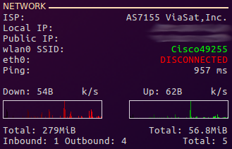

# Conky Config

This repo is used to house my configuration for conky. I'm constantly tweaking and fiddling with it so hopefully this repo can help keep track of everything.

## Install

  1. Install conky (e.g. Ubuntu): `sudo apt-get install conky`
  2. Clone this repo.
  3. Copy everything in the repo's **conky** folder into `~/.conky` in your home directory.
     - For the weather scripts to work, copy the **1_accuweather** folder into your home directory `~/`
  4. Run `./start.sh`

## Overview

Here is my entire desktop showing all of the conky goodness.

## Individual Panels

I have created individual conkyrc's for each set of stats I want to display. Here is a breakdown of each panel.

systemrc  
  

cpurc  
  

gpurc  

memoryrc  

diskrc  

networkrc  

modified *.conkyrc_1_images_wind_2016* from the [accuweather](https://forums.bunsenlabs.org/viewtopic.php?id=189) scripts  

calrc  

syslogrc (Clock with optional logs of `/var/log/syslog` and `dmesg`)  

